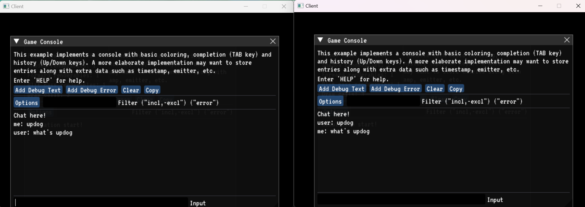

# YoYo Networking

<i>
	My networking library for the YoYo Renderer https://github.com/MokaHiko/YoYo.git
</i>

### Getting Started

<ol>

<li>
<u><b>
Download the repo 
</b></u>
</li>

git clone --recursive https://github.com/MokaHiko/YoYoQuickStart.git.

If the repository was cloned non-recursively previously, use git submodule update --init to clone the necessary submodules.

<li>
<u><b>
Configuration 
</b></u>
</li>

Run configure.bat or build manual build using cmake -S ./ -B ./build

</ol>

### Features 

	<h4>Chat</h4>
	</img>

